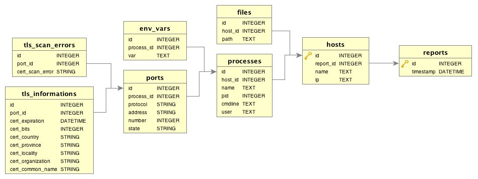

     .d8888b.   .d8888b.        d8888 888b    888 88888888888 8888888b.   .d88888b.  888b    888
    d88P  Y88b d88P  Y88b      d88888 8888b   888     888     888   Y88b d88P" "Y88b 8888b   888
    Y88b.      888    888     d88P888 88888b  888     888     888    888 888     888 88888b  888
     "Y888b.   888           d88P 888 888Y88b 888     888     888   d88P 888     888 888Y88b 888
        "Y88b. 888          d88P  888 888 Y88b888     888     8888888P"  888     888 888 Y88b888
          "888 888    888  d88P   888 888  Y88888     888     888 T88b   888     888 888  Y88888
    Y88b  d88P Y88b  d88P d8888888888 888   Y8888     888     888  T88b  Y88b. .d88P 888   Y8888
     "Y8888P"   "Y8888P" d88P     888 888    Y888     888     888   T88b  "Y88888P"  888    Y888


### BUILDING

1. Install dep, the vendor package manager: https://github.com/golang/dep
2. `go get github.com/pivotal-cf/scantron`
3. `cd $GOPATH/src/github.com/pivotal-cf/scantron && dep ensure`
4. `./build.sh`

### SYNOPSIS

    scantron <bosh-scan|direct-scan|generate-manifest|audit> [command options]

### OPENSSL REQUIREMENT

Scantron requires a minimum OpenSSL version of `1.0.2k`. The version of OpenSSL
shipped with OS X by default is very old and will not work with Scantron. You
can get this version from Homebrew by running

    brew install openssl

This will not be used by default though. Make sure to add
`/usr/local/opt/openssl/bin` to your `PATH` before running Scantron.

### COMMAND OPTIONS

#### BOSH-SCAN

    --nmap-results=PATH                        Path to nmap results XML (See GENERATING NMAP RESULTS)
    --director-url=URL                         BOSH Director URL
    --director-username=USERNAME               BOSH Director username
    --director-password=PASSWORD               BOSH Director password
    --bosh-deployment=DEPLOYMENT_NAME          BOSH Deployment

    --gateway-username=USERNAME                BOSH VM gateway username
    --gateway-host=URL                         BOSH VM gateway host
    --gateway-private-key=PATH                 BOSH VM gateway private key

    --uaa-client=OAUTH_CLIENT                  UAA Client
    --uaa-client-secret=OAUTH_CLIENT_SECRET    UAA Client Secret
    --database=PATH                            Location to store report (default: ./database.db)

#### DIRECT-SCAN

    --nmap-results=PATH                        Path to nmap results XML (See GENERATING NMAP RESULTS)
    --address=ADDRESS                          Address to scan
    --username=USERNAME                        Username to scan with
    --password=PASSWORD                        Password to scan with
    --private-key=PATH                         Private key to scan with (optional)
    --database=PATH                            Location to store report (default: ./database.db)

#### GENERATE-MANIFEST

    --database=PATH                            Path to report database (default: ./database.db)

#### AUDIT

    --database=PATH                            Path to report database (default: ./database.db)
    --manifest=PATH                            Path to manifest


### GENERATING NMAP RESULTS

Use nmap to scan 10.0.0.1 through 10.0.0.6, outputting the results as XML.
These XML results are used to extract host information internally in
`direct-scan` and `bosh-scan`. For more on nmap see
[here](http://www.explainshell.com/explain?cmd=nmap+-oX+results.xml+-v+--script+ssl-enum-ciphers+-sV+-p+-+10.0.0.1-6):

    nmap -oX results.xml -v --script ssl-enum-ciphers -sV -p - 10.0.0.1-6


### EXAMPLES

    # Direct scanning
    scantron direct-scan --nmap-results results.xml \
      --address scanme.example.com --username ubuntu \
      --password hunter2

    # BOSH
    scantron bosh-scan --nmap-results results.xml \
      --director-url=URL \
      --director-username=USERNAME \
      --director-password=PASSWORD \
      --bosh-deployment=DEPLOYMENT_NAME

    # BOSH with gateway
    scantron bosh-scan --nmap-results results.xml \
      --director-url=URL \
      --director-username=USERNAME \
      --director-password=PASSWORD \
      --bosh-deployment=DEPLOYMENT_NAME \
      --gateway-username=USERNAME \
      --gateway-host=URL \
      --gateway-private-key=PATH

    # BOSH with UAA
    scantron bosh-scan --nmap-results results.xml \
      --director-url=URL \
      --bosh-deployment=DEPLOYMENT_NAME \
      --gateway-username=USERNAME \
      --gateway-host=URL \
      --gateway-private-key=PATH \
      --uaa-client=OAUTH_CLIENT \
      --uaa-client-secret=OAUTH_CLIENT_SECRET

     # GENERATE-MANIFEST
     scantron generate-manifest > bosh.yml

     # AUDIT
     scantron audit --manifest bosh.yml

### SCAN FILTER

Scantron only scans regular files and skips the following directories:

  * /proc
  * /sys
  * /dev

### AUDIT

Prior to running audit, run `bosh-scan` or `direct-scan` to create a report
(see Database Schema). Then `generate-manifest` (see Manifest Format) to create
a starting point with a known-good configuration.  Some hand-tweaking may be
necessary to handle non-deterministic ports in the generated manifest file. The
resulting manifest file is compared against report.

Audit outputs the audited hosts along with either `err` or `ok`. When there's
any error, audit highlights the mismatched processes, ports, and/or permissions
and returns with exit code 3. If audit does not have any errors, it will return
with exit code 0.

### DATABASE SCHEMA

Scantron produces a SQLite database for scan reports with the following schema:



Each scan creates a report with many hosts in it. Hosts represent scanned VMs
which contain the list of world writable files and processes running on that
machine. Each process is referenced by the port it is listening on and its
environment variables. TLS information is provided for a port when the port is
expecting TLS connections.

### EXAMPLE QUERIES

Finding all of the hosts which are listening on a particular port:

``` sql
SELECT hosts.NAME
FROM ports
  JOIN processes
    ON ports.process_id = processes.id
  JOIN hosts
    ON processes.host_id = hosts.id
WHERE ports.number = 6061
  AND ports.state = "listen"
```

### MANIFEST FORMAT

Scantron audits the hosts, processes, and ports in the database against the
user-generated manifest file.

For Ops Manager where VMs can have the same prefix, such as cloud_controller
and cloud_controller_worker, append "-" to the prefixes: "cloud_controller-"
and "cloud_controller_worker-".

Many hosts (especially those which are based of the BOSH stemcell) will start
processes that bind to an ephemeral, random port when they start. To avoid
caring about these ports when we perform an audit you can add `ignore_ports:
true` to the process. There is an example of this below for the `rpc.statd`
process.

This is an example of the manifest file:

``` yaml
specs:
- prefix: cloud_controller-
  processes:
  - command: sshd
    user: root
    ports:
    - 22
  - command: rpcbind
    user: root
    ports:
    - 111
  - command: metron
    user: vcap
    ports:
    - 6061
  - command: consul
    user: vcap
    ports:
    - 8301
  - command: nginx
    user: root
    ports:
    - 9022
  - command: ruby
    user: vcap
    ports:
    - 33861
  - command: rpc.statd
    user: root
    ignore_ports: true
```
